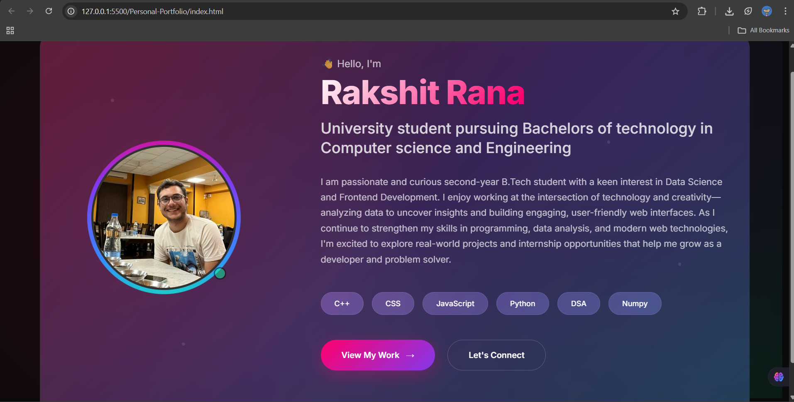

# Personal Portfolio 🌟

> HEY! This is a little sneak peek of what I am up to these days and what I aspire to become. Do check it out as it talks about my latest projects.

A modern, responsive personal portfolio website showcasing my skills, projects, experience, and journey as a developer. Built with clean code and contemporary design principles to create an engaging user experience.

## 🚀 Live Demo

[View Live Portfolio] https://personal-portfolio-weld-alpha.vercel.app/

## 📸 Preview




## ✨ Features

- **📱 Responsive Design** - Seamlessly adapts to all device sizes (mobile, tablet, desktop)
- **🎨 Modern UI/UX** - Clean, professional design with smooth animations
- **⚡ Fast Loading** - Optimized for performance with minimal load times
- **🌙 Dark/Light Mode** - Toggle between themes for better user experience
- **📝 Dynamic Content** - Easy to update projects and information
- **💌 Contact Form** - Functional contact form with form validation
- **🔍 SEO Optimized** - Meta tags and structured data for better search visibility

## 🛠️ Technologies Used

- **Frontend:**
  - HTML5 (Semantic markup)
  - CSS3 (Flexbox, Grid, Animations)
  - JavaScript (ES6+)

- **Tools & Deployment:**
  - Git & GitHub
  - GitHub Pages / Vercel

## 📁 Project Structure

```
Personal-Portfolio/
|---index.html # Main HTML file
|---connect.html
|---view.html             
├── assets/
│   ├── css/
│   │   ├── styles.css       # Main stylesheet
│   │   └── styles1.css  # Responsive styles
│   ├── screenshots/
│   │   |--- profile.jpg     # Profile picture
│   │   |--- connect.png     # Project screenshots
|   |   |--- console_output.png
|   |   |--- gainer_loser.png
|   |   |--- intro.png
|   |   |--- market_cap.png
|   |   |--- price_trends.png
|   |   |--- volatility.png 
|   |   |--- work.png   
│   │   └── icons/          # Icon assets
│   └── files/
│       └── resume.pdf      # Resume/CV file
├── README.md
└── LICENSE
```

## 🎯 Sections

### 🏠 Home
- Hero section with introduction
- Professional tagline and call-to-action
- Links to social profiles

### 👨‍💻 About
- Personal introduction and background
- Skills and technologies
- Education and certifications
- Fun facts and interests

### 💼 Projects
- Featured projects with descriptions
- Technologies used for each project
- Live demo and source code links
- Project categories/filtering

### 🎓 Experience
- Work experience and internships
- Key achievements and responsibilities
- Timeline format for easy reading

### 📞 Contact
- Contact form with validation
- Social media links
- Professional email
- Location information

## 🚀 Getting Started

### Prerequisites
- A modern web browser
- Basic knowledge of HTML, CSS, and JavaScript (for customization)

### Installation

1. **Clone the repository**
   ```bash
   git clone https://github.com/rakshittttt/Personal-Portfolio.git
   ```

2. **Navigate to project directory**
   ```bash
   cd Personal-Portfolio
   ```

3. **Open in your browser**
   ```bash
   # Simply open index.html in your browser
   # Or use a local server
   python -m http.server 8000  # Python 3
   # Or
   npx http-server              # Node.js
   ```

4. **View the portfolio**
   - Open `http://localhost:8000` in your browser


---

⭐ **Star this repo if you found it helpful!**

📬 **Get in Touch**
- Email: [rakshitrana412@gmail.com]
- LinkedIn: (https://www.linkedin.com/in/rakshit-rana-3baba0280/)

Made with ❤️ by Rakshit Rana